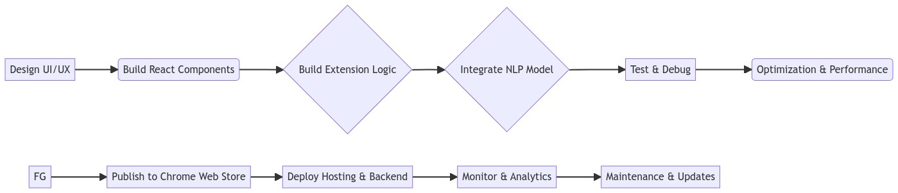

# RecapAI

```markdown
recapai
├── public
│ ├── icons
│ │ └── icon-16.png
│ │ └── icon-32.png
│ │ └── icon-128.png
│ ├── images
│ │ └── logo.png
│ │ └── image1.jpg
│ │ └── image2.jpg
│ ├── manifest.json
│ │ └── _populated_
│ └── index.html
├── src
│ ├── components
│ │ ├── Popup.js
│ │ └── Options.js
│ │ └── /_ component docs _/
│ ├── background
│ │ └── background.js
│ ├── contentScript
│ │ └── contentScript.js
│ ├── utils
│ │ └── nlpAPI.js
│ ├── index.js
│ └── App.js
├── package.json
│ └── _dependencies installed_
├── .gitignore
├── README.md
├── CHANGELOG.md
├── webpack.config.js
├── .eslintrc
├── tests
│ └── sample.test.js
│ └── /_ more tests _/
├── buildScripts
│ └── build.js
├── deployScripts
│ └── deploy.js
├── LICENSE
├── styles
│ └── styles.css
└── package-lock.json
```



# Project Planning

## Planning Phase

- Create user stories to define MVP features, nice-to-haves, and future ideas.
- Map UI/UX flow
  - Diagram core user interactions
  - Identify key pages and components
  - Sketch information architecture
- Design mockups
  - Sketch initial mockups
  - Create higher fidelity visual designs
  - Iterate based on feedback
- Evaluate technology stack
  - Research options
  - Make preliminary decisions
  - Document reasons for choices
- Set up project tracking
  - Choose tracking tool (e.g. Trello)
  - Create boards and lists
  - Add tickets for tasks
  - Assign owners

## Development Phase

### Set up React project

- Initialize React project
- Integrate Chrome extension support
- Configure build and packaging

### Implement summarization feature

- Content script to extract text
- Background script for processing
- Display summary in popup

### Build options page

- Allow summary customization
- Remember user preferences

### Add toolbar shortcut

- Icon clicks trigger summarization
- Add context menu
- Right-click to summarize

### Construct settings page

- Enable configuration options
- Implement Firebase Auth
  - Sign up and login flows
  - Persist user sessions
- Integrate Firebase Firestore
  - Save user data
  - Sync across clients

### Develop React components

- Modular, reusable components
- Responsive design
- Follow Chrome UX principles
  - Match Chrome styling
  - Consistent layouts

### Leverage ChatGPT for Fine Print Summaries

- Analyze common fine print documents like insurance policies and outline key sections and terminology.
- Build a dataset of sample documents across different providers.
- Draft initial prompt templates focused on summarizing obligations, exclusions, limitations.
- Implement backend to pass selected text to ChatGPT API with appropriate prompts.
- Display returned summaries in the extension popup and sidebar.
- Set up analytics to monitor summary quality over time based on user feedback.
- Refine prompts continuously based on analytics to improve relevance, accuracy, and conciseness.
- Expand prompts and training data to cover emerging fine print document types.
- Cache generated summaries to improve performance and avoid duplicative generation.
- Follow best practices around responsible AI use, transparency, and human oversight.
- Focus on domain-specific prompts as they tend to perform better than generic prompts.
- Rigorously test outputs across diverse documents and edge cases.

## Testing Phase

- Write unit tests for key components and functionality.
- Develop E2E tests to validate end-to-end flows.
- Set up CI/CD pipeline with Github Actions.
- Test across browsers and devices to ensure compatibility.
- Conduct usability testing with target users.
- Fix bugs and refine UI/UX issues.

## Deployment Phase

### Optimize production build

- Minify code
- Eliminate unused exports
- Tree shaking
- Code splitting

### Package extension

- Generate manifest.json
- Asset bundling
- Sign .crx package
- Publish to Chrome Web Store
  - Create developer account
  - Submit for review
  - Publish listing

### Launch marketing plan

- Social media campaigns
- Blog content
- SEO optimization

### Monitor app health

- Track errors and crashes
- User analytics
- Feedback channels

### Maintenance plan

- Schedule regular releases
- Ongoing performance testing
- Monitor changelog
- Regression testing

## Overview

RecapAI is an AI-powered platform designed to simplify complex documents and text. Making the fine print crystal clear.

## Key Features

RecapAI offers a range of powerful features to enhance user interaction with complex text:

### Feature 1: Instant Summaries

RecapAI enables users to generate concise document summaries instantly through natural language processing.

### Feature 2: Plain Language Translation

RecapAI translates complex jargon and legalese into understandable language.

### Feature 3: Insight Extraction

RecapAI extracts and highlights key details, figures, obligations, rights, and action items from complex text.

### Feature 4: Customizable Summaries

RecapAI allows users to customize summary length and depth according to their needs.

### Feature 5: Interactive Assistance

RecapAI features an AI-powered assistant to clarify concepts and provide interactive guidance.

These features make RecapAI a versatile tool for simplifying complex text.

## Application Areas

RecapAI is applied in various domains:

- **Insurance Policies**: Analyzing and summarizing insurance policy terms.
- **Banking**: Handling banking documents and lengthy lists of fees.
- **Software/Tech**: Managing EULAs and terms of service agreements.
- **Wireless Carriers**: Dealing with multi-page contracts.
- **Credit Cards**: Understanding credit card agreements.
- **Travel Sites**: Handling reservations, cancellations, and related policies.
- **Pharmaceutical Companies**: Summarizing health warnings on products.

## How It Works

RecapAI simplifies complex text using advanced natural language processing.

## Use Cases

RecapAI is applied in various domains, resulting in several impactful use cases:

- **Insurance Policies**: Analyzing and summarizing insurance policy terms for better consumer understanding.
- **Banking**: Handling banking documents and translating lengthy lists of fees for user clarity.
- **Software/Tech**: Managing EULAs and terms of service agreements to simplify complex language.
- **Wireless Carriers**: Streamlining multi-page contracts for user comprehension.
- **Credit Cards**: Enhancing understanding of credit card agreements, particularly intricate terms.
- **Travel Sites**: Facilitating efficient handling of reservations, cancellations, and related policies.
- **Pharmaceutical Companies**: Simplifying health warnings on pharmaceutical product packaging.

RecapAI's versatile application across these domains showcases its adaptability and effectiveness in various contexts.

## Benefits

- Enhances understanding of complex text.
- Saves time and effort.

## Limitations

RecapAI may have limitations in handling highly specialized or context-specific content.

## Conclusion

RecapAI simplifies complex text, making it a valuable tool in various applications.

# Browser Extension Capabilities

RecapAI offers a range of browser extension capabilities for a seamless user experience:

- **Seamless Integration:** RecapAI seamlessly integrates into the Chrome browser, allowing on-demand use on any web page. Users can highlight text and access summaries without leaving their tab.

- **Popup Sidebar:** Summarized content and extracted insights appear in a clean popup sidebar for easy access and reference while browsing.

- **Toolbar Shortcut:** The RecapAI toolbar icon provides quick one-click access to start summarizing text on any webpage.

- **Cross-Platform:** The extension is available for download on Chrome web browsers across desktop and mobile platforms like Android and iOS.

- **Secure and Private:** RecapAI processes everything locally in the browser to keep data private. No content is ever sent externally.

- **Customizable Options:** Users can customize the extension to suit their preferences, including summary length, voice for reading aloud, highlighting colors, and more.

- **One-Click Sharing:** Easily share summarized content and insights via email, social media, or other apps directly from the extension popup.

## Technology Stack

- **UI Components:** Built using React to create UI components like popups, options, and sidebar.

- **Responsive Design:** Follows responsive design principles to ensure a consistent user experience across both desktop and mobile platforms.

- **In-Extension Navigation:** Integrates React Router for in-extension navigation.

- **Content Analysis:** Injects content scripts at runtime for webpage text analysis.

- **Natural Language Processing (NLP):** Executes NLP locally using TensorFlow Lite + WebAssembly for efficient text processing.

- **Background Processing:** Leverages service workers for background processing tasks.

- **Hosting:** Core files are hosted on Firebase Hosting for reliable and scalable delivery.

- **Account Management:** Utilizes Firebase Auth for account management.

- **User Data and Settings:** Stores user data and settings in Firebase Firestore for easy access and synchronization.

- **Serverless Logic:** Utilizes Firebase Functions for serverless logic execution.

- **Cross-Browser Compatibility:** Follows WebExtension APIs for cross-browser capability to ensure broad accessibility.

- **Code Structuring:** Implements TypeScript for structured and type-safe code.

- **Code Bundling:** Bundles code efficiently using Webpack for optimized performance.

- **CI/CD Pipeline:** Implements a CI/CD pipeline with Github Actions for automated testing and deployment.

- **Performance Optimization:** Limits DOM manipulation to enhance performance.

- **Asynchronous Logic:** Uses asynchronous logic to prevent blocking and ensure a smooth user experience.

- **Component Separation:** Separates components for single responsibility and maintainability.

- **Optimized Production Build:** Utilizes Preact for optimized production builds, improving performance and user experience.

- **Design Guidelines:** Follows Chrome UX guidelines and conventions for a consistent and user-friendly interface.

- **Mobile-Friendly Layouts:** Designs responsive and mobile-friendly layouts to accommodate various devices.

- **Accessibility:** Prioritizes accessibility to ensure the extension is usable by individuals with disabilities.

- **Permission Usage:** Clearly explains and requests permissions when needed, respecting user privacy.

- **Error Handling:** Properly handles errors to provide a seamless user experience.

- **Keyboard Shortcuts:** Implements keyboard shortcuts for user convenience.

- **Drag-and-Drop:** Implements drag-and-drop functionality where appropriate.

- **Web Store Listing Optimization:** Optimizes the Web Store listing for discoverability and user engagement.

- **Platform-Specific Guidelines:** Follows platform-specific guidelines to provide a consistent experience on different platforms.
